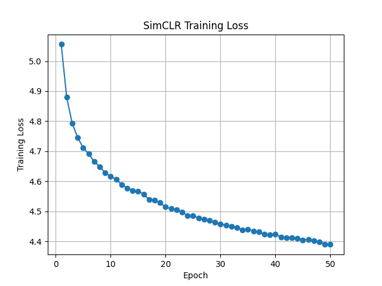
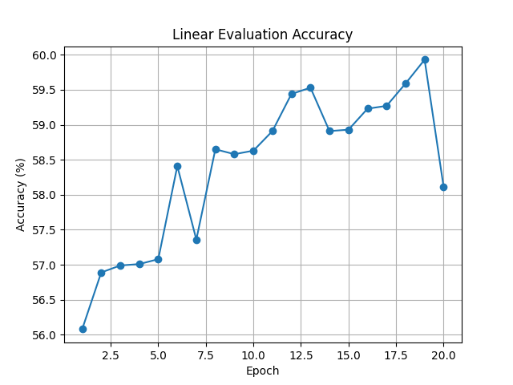
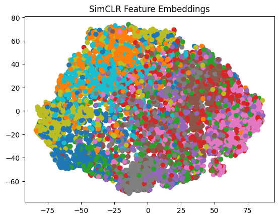
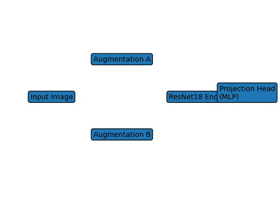

# Self-Supervised Representation Learning with SimCLR


[]()


Self-supervised learning has emerged as a powerful paradigm for learning visual representations without requiring labeled datasets.  
This repository implements the **SimCLR framework for contrastive representation learning** and evaluates its effectiveness on the **CIFAR-10 dataset**.

The project investigates how well representations learned without labels transfer to downstream tasks such as image classification.

---

# Project Overview

This project explores **contrastive self-supervised learning** for image representation learning.

Key goals:

- Learn visual representations **without labels**
- Evaluate feature usefulness through **linear classification**
- Study representation quality through **experiments and visualization**
- Analyze robustness under **limited data and noisy inputs**

---

# Methodology

Training pipeline:

Image  
↓  
Random Augmentation A → Encoder → Projection Head  
Random Augmentation B → Encoder → Projection Head  
↓  
Contrastive Loss (NT-Xent)

The model learns to:
- Bring embeddings of **two augmented views of the same image closer**
- Push embeddings of **different images apart**

---

# Model Architecture

Encoder: **ResNet18**  
Projection Head: **MLP (512 → 128)**  
Loss: **NT-Xent Contrastive Loss**

---

# Dataset

**CIFAR-10**

| Property | Value |
|--------|------|
| Images | 60,000 |
| Training Images | 50,000 |
| Test Images | 10,000 |
| Classes | 10 |
| Image Size | 32×32 |

---

# Training Results

SimCLR was trained for **50 epochs**.

| Epoch | Loss |
|------|------|
| 1 | 5.0557 |
| 5 | 4.7116 |
| 10 | 4.6161 |
| 20 | 4.5148 |
| 30 | 4.4576 |
| 40 | 4.4241 |
| 50 | **4.3899** |

## Training Loss



---

# Linear Evaluation Results

| Epoch | Accuracy (%) |
|------|-------------|
| 1 | 56.08 |
| 5 | 57.08 |
| 10 | 58.63 |
| 15 | 58.93 |
| 18 | 59.59 |
| 19 | **59.93** |
| 20 | 58.11 |

Peak accuracy achieved: **59.93%**

## Linear Evaluation Accuracy




---

# Experiments

## Data Scarcity

Classifier trained with:

- 10% labels
- 50% labels
- 100% labels

Goal: evaluate representation usefulness when labeled data is limited.

## Noise Robustness

Gaussian noise was applied to input images.

Noise configuration:
- Noise type: Gaussian
- Standard deviation: 0.3

---

# Visualization

Example embedding visualization using t-SNE:



## SimCLR Architecture



---

# Repository Structure

## Repository Structure

```
ssl-image-learning/
│
├── data/                         # Dataset storage (e.g., CIFAR-10)
│
├── models/
│   └── simclr_model.py           # SimCLR encoder + projection head implementation
│
├── utils/
│   └── contrastive_loss.py       # NT-Xent contrastive loss implementation
│
├── train/
│   └── train_simclr.py           # Self-supervised training pipeline for SimCLR
│
├── eval/
│   └── linear_eval.py            # Linear evaluation protocol with frozen encoder
│
├── experiments/
│   ├── data_scarcity.py          # Experiments with limited labeled data
│   └── noise_robustness.py       # Experiments testing robustness to noisy inputs
│
├── notebooks/
│   └── visualize_embeddings.ipynb  # Visualization of learned representations
│
├── results/                      # Training logs, plots, and evaluation outputs
│
└── README.md                     # Project documentation
```


---

# Installation

```bash
git clone https://github.com/yourusername/ssl-image-learning.git
cd ssl-image-learning
```

Create environment:

```bash
conda create -n ssl python=3.10
conda activate ssl
```

Install dependencies:

```bash
pip install torch torchvision scikit-learn matplotlib tqdm
```

---

# Usage

Train SimCLR:

```bash
python train/train_simclr.py
```

Linear evaluation:

```bash
python eval/linear_eval.py
```

Run experiments:

```bash
python experiments/data_scarcity.py
python experiments/noise_robustness.py
```

---

# Results Summary

| Metric | Value |
|------|------|
| Training Epochs | 50 |
| Final Training Loss | 4.3899 |
| Linear Evaluation Accuracy | 59.93% |
| Dataset | CIFAR-10 |

---

# Future Work

- Compare with other SSL methods (MoCo, BYOL, DINO)
- Train on larger datasets (STL-10 / ImageNet subsets)
- Perform augmentation ablation studies
- Test transfer learning on new tasks

---

# Author

**Hema Sagar Koppusetti**  
B.Tech – Artificial Intelligence & Machine Learning  
Lendi Institute of Engineering and Technology  

GitHub: https://github.com/HemaSagarKoppusetti  
LinkedIn: https://linkedin.com/in/hema-sagar-koppusetti

---

# License

MIT License
